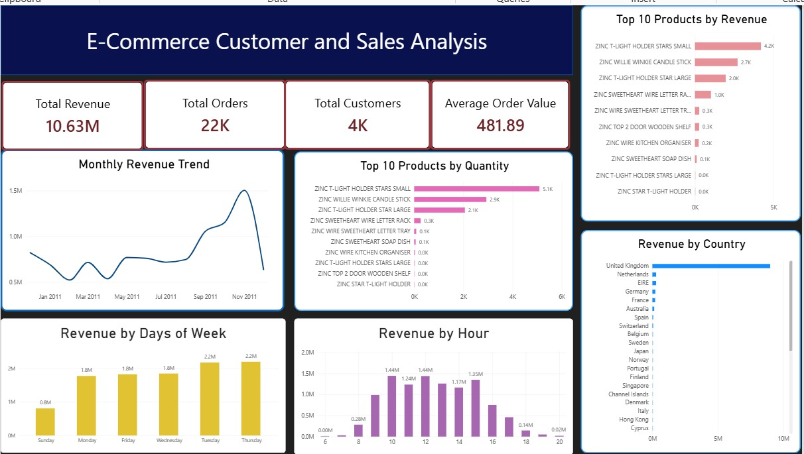
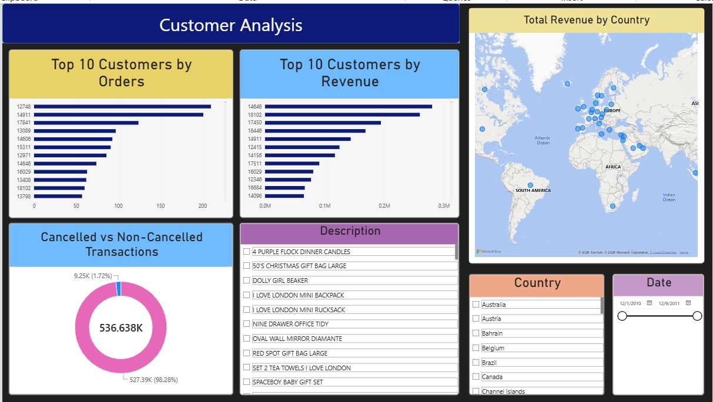

# E-Commerce Customer & Sales Analysis


## 📌 Project Overview

This project analyzes an e-commerce sales dataset to understand overall sales performance, customer behavior, product performance, geographical sales patterns, and transaction activity.

The project follows a complete data analytics workflow:

**Python → Exploratory Data Analysis → SQL → Power BI Dashboard**

The analysis focuses on identifying important business patterns such as top-performing products, high-value customers, revenue trends, customer purchasing behavior, country-level performance, and cancelled transactions.

---
## 🎯 Project Objectives

The main objectives of this project are to:

- Analyze overall sales performance
- Identify the highest-revenue products
- Identify high-value customers
- Analyze customer order frequency
- Understand revenue trends over time
- Compare revenue across countries
- Analyze sales by day of the week and hour
- Analyze cancelled transactions
- Calculate important business KPIs
- Use SQL to answer business questions
- Build an interactive Power BI dashboard

---
## 📊 Dataset

The project uses an **Online Retail** transaction dataset containing information about:

- Invoice Number
- Stock Code
- Product Description
- Quantity
- Invoice Date
- Unit Price
- Customer ID
- Country

### Dataset Size

The original dataset contained:

- **541,909 rows**
- **8 columns**

During the data-cleaning stage, **5,268 exact duplicate rows** were identified and removed.

The following analytical columns were then created:

- `IsCancelled`
- `Revenue`

Date-based analysis was also performed using `InvoiceDate`.

---
## 📈 Power BI Dashboard





## 🛠️ Tools & Technologies

- **Python**
  - Pandas
  - NumPy
  - Matplotlib
  - Seaborn

- **SQL**
  - MySQL

- **Power BI**
- **Jupyter Notebook**
---

## 📂 Project Structure

```text
Ecommerce-customer-and-sales-analysis/
│
├── python/
│   └── ecommerce_analysis.ipynb
│
├── sql/
│   └── ecommerce_analysis.sql
│
├── power BI/
│   └── ecommerce_dashboard.pbix
│
|── images/
│   └──image1.jpeg & image2.jpeg
└── README.md
```
## 👩‍💻 Author

**Irsa Shakeel**

Aspiring Data Analyst | Python | SQL | Power BI
